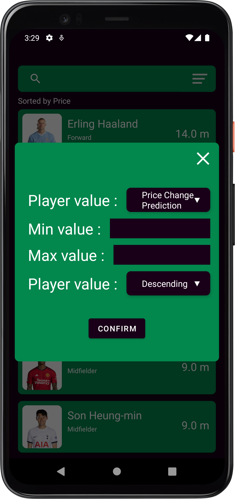

<h1 align="center">
	
</h1>

<h3 align="center">
  FPL Assistant
</h3>

<p align="center">Android App</p>

<p align="center">
  

  <a href="https://www.linkedin.com/in/mohamedamgd/">
    
  </a>
  
  
  
  <a href="https://github.com/MohamedAmgd/FPL-Assistant/commits/main">
    
  </a>
  
  <a href="https://github.com/MohamedAmgd/FPL-Assistant/issues">
    
  </a>
  
  
</p>

<p align="center">
  <a href="#-about-the-project">About the project</a>&nbsp;&nbsp;&nbsp;|&nbsp;&nbsp;&nbsp;
  <a href="#-technologies">Technologies</a>&nbsp;&nbsp;&nbsp;|&nbsp;&nbsp;&nbsp;
  <a href="#-getting-started">Getting started</a>&nbsp;&nbsp;&nbsp;|&nbsp;&nbsp;&nbsp;
  <a href="#-how-to-contribute">How to contribute</a>&nbsp;&nbsp;&nbsp;|&nbsp;&nbsp;&nbsp;
  <a href="#-license">License</a>
</p>
<p align="center">
  <a href="https://github.com/MohamedAmgd/FPL-Assistant/releases/latest/download/FPL-Assistant.apk">
    
  </a>
</p>

## 👨🏻‍💻 About the project

- <p style="color: red;">An Android app that shows a usefull info and stats about football players in fantasy premier league
- It shows for each player:-
  <ul>
- A prediction for price change
- The amount of price change
- Ownership
- Point per price
- Form
- Total points
- Fixtures
  </ul>
</p>

|  |  |  |  |
| ------------------------------------ | ------------------------------------ | ------------------------------------ | ------------------------------------ |

This app gets these data from an external api. To see this **api**, click here: [FPL Assistant Rest API](https://github.com/MohamedAmgd/FPL-Assistant-Api)</br>

## 🚀 Technologies

Technologies that I used to develop this mobile client

- [Android 11 (Api level 30)](https://developer.android.com/about/versions/11)
- [Kotlin](https://kotlinlang.org/)
- [Material Design](https://m2.material.io/design)
- [Shimmer](https://github.com/facebookarchive/shimmer-android)
- [Coroutines](https://kotlinlang.org/docs/coroutines-overview.html)
- [Retrofit](https://kotlinlang.org/docs/coroutines-overview.html)
- [Glide](https://kotlinlang.org/docs/coroutines-overview.html)
- [Firebase](https://kotlinlang.org/docs/coroutines-overview.html)

## 💻 Getting started

### Requirements

- Have this application's [API](https://github.com/MohamedAmgd/FPL-Assistant-Api) running

**Clone the project and access the folder**

```bash
$ git clone https://github.com/MohamedAmgd/FPL-Assistant.git && cd FPL-Assistant
```

**Configre Api**

- Add the api url in baseUrl in [This file](app/src/main/java/com/mohamed_amgd/fpl_assistant/data/retrofit/RetrofitHelper.kt)

**Configre firebase**

- Generate a google-services.json file [How to get google-services.json file](https://firebase.google.com/docs/android/setup#register-app)
- Replace the empty google-services.json file by the generated one

### Working with Android Studio.

[Android Studio](https://developer.android.com/studio) is currently the official Android IDE. Due to this, it is recommended as the IDE to use in your development environment.

It is recommended to use the last version available in the stable channel of Android Studio updates. See what update channel is your Android Studio checking for updates in the menu path 'Help'/'Check for Update...'/link 'Updates' in the dialog.

To set up the project in Android Studio follow the next steps:

- Open Android Studio and select 'Import Project (Eclipse ADT, Gradle, etc)'. Browse through your file system to the folder 'android' where the project is located. Android Studio will then create the '.iml' files it needs. If you ever close the project but the files are still there, you just select 'Open Project...'. The file chooser will show an Android face as the folder icon, which you can select to reopen the project.
- Android Studio will try to build the project directly after importing it. To build it manually, follow the menu path 'Build'/'Make Project', or just click the 'Play' button in the tool bar to build and run it in a mobile device or an emulator. The resulting APK file will be saved in the 'build/outputs/apk/' subdirectory in the project folder.

### Working in a terminal with Gradle:

[Gradle](https://gradle.org/) is the build system used by Android Studio to manage the building operations on Android apps. You do not need to install Gradle in your system, and Google recommends not to do it, but instead trusting on the [Gradle wrapper](https://docs.gradle.org/current/userguide/gradle_wrapper.html) included in the project.

- Open a terminal and go to the 'android' directory that contains the repository.
- Run the 'clean' and 'build' tasks using the Gradle wrapper provided
  - Windows: `gradlew.bat clean build`
  - Mac OS/Linux: `./gradlew clean build`

The first time the Gradle wrapper is called, the correct Gradle version will be downloaded automatically. An Internet connection is needed for it works.
The generated APK file is saved in android/build/outputs/apk as android-debug.apk

## 🤔 How to contribute

**Make a fork of this repository**

```bash
# Fork using GitHub official command line
# If you don't have the GitHub CLI, use the web site to do that.

$ gh repo fork MohamedAmgd/FPL-Assistant
```

**Follow the steps below**

```bash
# Clone your fork
$ git clone your-fork-url && cd FPL-Assistant

# Create a branch with your feature
$ git checkout -b my-feature

# Make the commit with your changes
$ git commit -m 'feat: My new feature'

# Send the code to your remote branch
$ git push origin my-feature
```

After your pull request is merged, you can delete your branch

## 📝 License

This project is licensed under the GPLv3 License - see the [LICENSE](LICENSE) file for details.

---

Made by Mohamed Amgd 👋 [See my linkedin](https://www.linkedin.com/in/mohamedamgd/)
